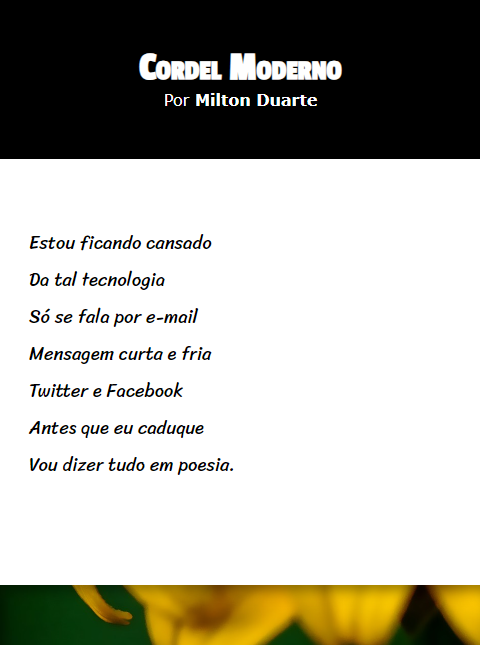

# Cordel-Page
Este repositório abriga meu projeto de estudo baseado nos cordéis do renomado autor Milton Duarte. Explore este espaço para encontrar análises, implementações e insights sobre a rica tradição do cordel, com foco especial no trabalho envolvente de Duarte. Aprecie a arte e cultura do cordel.

# Link para a Página

Link: https://eduardosichelero.github.io/Cordel-Page/

# Screenshot
Prévia do projeto :

